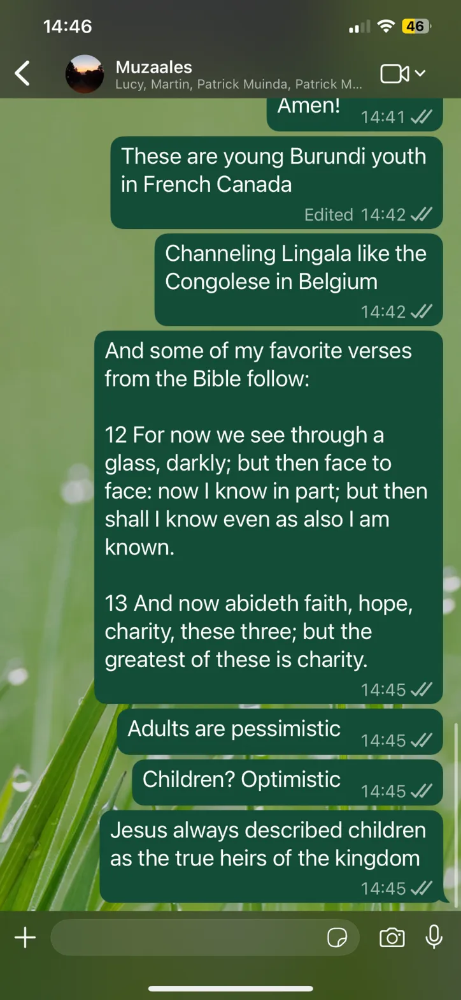
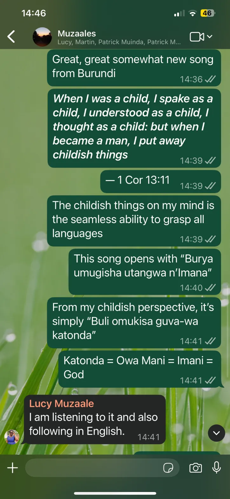
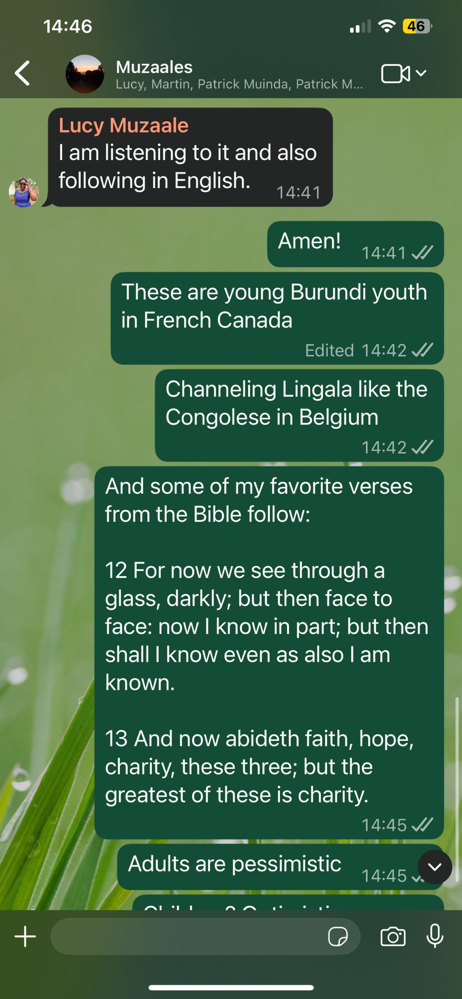
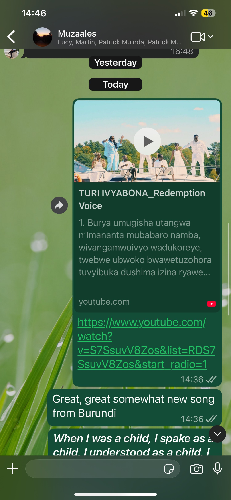

  
  
  
  

# D
# O
# A
## 1
Here's the transcription of the WhatsApp conversation:

**Group:** Muzaales
**Participants:** Lucy, Martin, Patrick Muinda, Patrick M...

---

**[14:41]** Amen!

**[14:42]** These are young Burundi youth in French Canada
*(Edited 14:42)*

**[14:42]** Channeling Lingala like the Congolese in Belgium

**[14:45]** And some of my favorite verses from the Bible follow:

12 For now we see through a glass, darkly; but then face to face: now I know in part; but then shall I know even as also I am known.

13 And now abideth faith, hope, charity, these three; but the greatest of these is charity.

**[14:45]** Adults are pessimistic

**[14:45]** Children? Optimistic

**[14:45]** Jesus always described children as the true heirs of the kingdom

## 2
Here's the transcription of the WhatsApp conversation:

**Group:** Muzaales
**Participants:** Lucy, Martin, Patrick Muinda, Patrick M...

---

**[14:36]** Great, great somewhat new song from Burundi

**[14:39]** *When I was a child, I spake as a child, I understood as a child, I thought as a child: but when I became a man, I put away childish things*

**[14:39]** — 1 Cor 13:11

**[14:39]** The childish things on my mind is the seamless ability to grasp all languages

**[14:40]** This song opens with "Burya umugisha utangwa n'Imana"

**[14:41]** From my childish perspective, it's simply "Buli omukisa guva-wa katonda"

**[14:41]** Katonda = Owa Mani = Imani = God

**Lucy Muzaale [14:41]** I am listening to it and also following in English.

## 3
Coming soon .. 

# X
## 1
### WhatsApp Chat Transcription: Muzzaales Group

**Participants:** Lucy, Martin, Patrick Muinda, Patrick M…  
**Time:** Around 14:41–14:45 (likely local time, November 06, 2025)

-----

**[14:41]**  
**Lucy Muzaaale**  
I am listening to it and also  
following in English.

**[14:41]**  
Amen!

**[14:42] (Edited)**  
**Lucy Muzaaale**  
These are young Burundi youth  
in French Canada

**[14:42]**  
**Lucy Muzaaale**  
Channeling Lingala like the  
Congoleseese in Belguim

**[14:45]**  
**Lucy Muzaaale**  
And some of my favorite verses  
from the Bible follow:

> 12 For now we see through a  
> glass, darkly; but then face  
> to face: now I know in part; but then  
> shall I know even as also I am  
> known.
> 
> 13 And now abideth faith, hope,  
> charity, these three; but the  
> greatest of these is charity.

**[14:45]**  
**Lucy Muzaaale**  
Adults are pessimistic

-----

*(Note: Typos and formatting preserved as appearing in the screenshot, e.g., “Burundi youth” likely means “Burundian youth”; “Congoleseese” and “Belguim” as shown. Bible verses from 1 Corinthians 13:12-13, KJV translation. The conversation appears to reference listening to something—possibly audio/podcast in French with English subtitles—featuring Burundian youth channeling Lingala music/styles, akin to Congolese diaspora in Belgium.)*

## 2
### WhatsApp Chat Transcription: Muzzaales Group

**Participants:** Lucy, Martin, Patrick Muinda, Patrick M…  
**Time:** Around 14:36–14:46 (likely local time, November 06, 2025; includes “Yesterday” and “Today” sections)

-----

**[Yesterday] [16:48]**  
*(No visible messages in this section from the screenshot.)*

-----

**[Today] [14:36]**  
**Shared Media: YouTube Video**  
**Title:** TURI IYABONONA_Remdemption  
**Thumbnail Description:** Group of people (possibly performers) in white attire outdoors near trees, with a play button overlay.  
**Caption/Lyrics Snippet (in Kirundi/Burundian):**

1. Buraya umugisha utangwa  
   n’imananta mubabaro namba,  
   wivangamwoiyo wadukoreye,  
   twewe ubwokwo bwateuzohora  
   tweyibuka dushimira izina ryawe…

**YouTube Link:**  

  <iframe
    src="https://www.youtube.com/embed/S7SsuV8ZOs" width="49%" height="500px"
    >
  </iframe>

-----

**[14:36]**  
**Lucy Muzaaale** (inferred from context)  
Great, great something new song  
from Burundii

-----

**[14:36]**  
**Lucy Muzaaale** (partial message)  
When I was a child, I spake as a  
child. I understood as a child. I

-----

*(Note: Typos preserved as in screenshot, e.g., “Remdemption” likely “Redemption”; “Burundii” for “Burundi”; “spake” archaic from KJV Bible. This appears to continue the previous chat’s theme—Burundian youth/music (possibly gospel/redemption song in Kirundi) and 1 Corinthians 13:11: “When I was a child, I spake as a child, I understood as a child, I thought as a child…”. The video link points to a Burundian gospel track by artists like “Turikuvuga Imana” or similar, based on lyrics/themes of gratitude and praise.)*
## 3

# G
